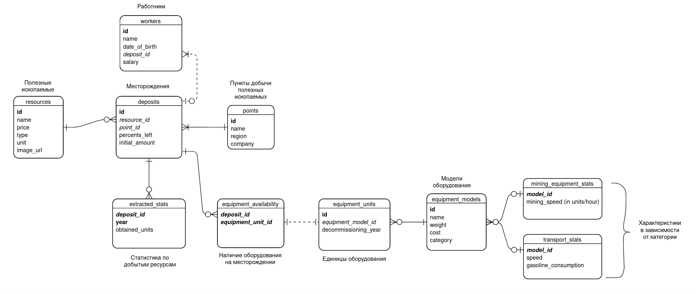
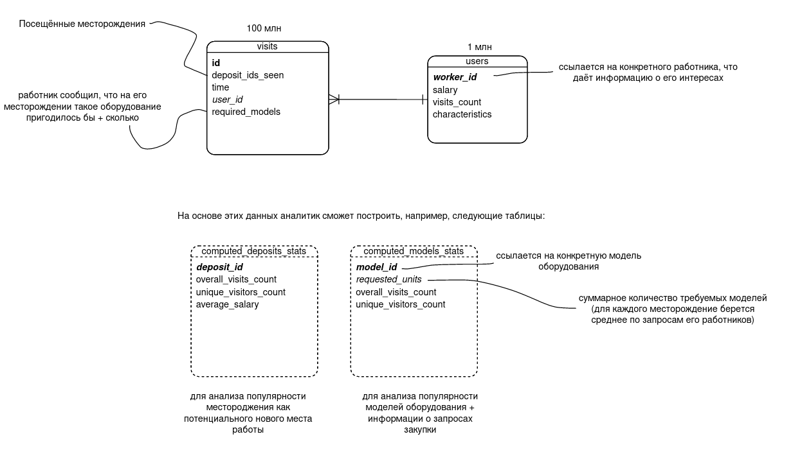

## Практикум по Postgresql

ERD для заданий 2.x:



ERD для заданий 3.x:



Их делал [тут](https://online.visual-paradigm.com/diagrams/templates/entity-relationship-diagram/notations-for-traditional-erd/)

Ниже есть 2 инструкции — по установке postgresql на manjaro и по переносу папки с бд на hdd. 

Инструкции, как и лабы, могут содержать ошибки, неточности и т.д., предоставляются по принципу "AS IS" без каких-либо гарантий :)

-- **Update**: [@ubsefor](https://github.com/ubsefor) добавил инструкции к макоси чтобы уважаемые любители настоящего юникса не ощущали себя ущемленными/угнетенными

Удачи! 

## Установка Postgres 11 на Manjaro
Почему 11? На сайте курса написано, что нужен 11. Думаю, что если использовать самую новую версию, никаких проблем не возникнет. Но я не стал рисковать, поэтому вот гайд:

Ставится больно,  но работает. 

Опционально: Ставим [AUR-helper](https://wiki.archlinux.org/title/AUR_helpers) (я рекомендую [yay](https://aur.archlinux.org/packages/yay/))

Ставим AUR-пакет `postgresql-11` (на праке требуют 11.x версию)

postgres работает через отдельного пользователя. Особенность — в него нельзя зайти через пароль. Поэтому сделать это может только рут: `sudo su postgres` (тут уже пароль от рута нужен).

```bash
sudo chown postgres:postgres /var/lib/postgres
sudo su postgres
cd
initdb -D data
echo "pg_ctl -D data/ -l logfile start" > run.sh
chmod +x run.sh
./run.sh
vim data/postgresql.conf # изменить `unix_socket_directories` на '/tmp'
```

## Установка Postgres 11 на Mac OS

Есть несколько вариантов:

- Скачать с офф сайта [установщик](https://content-www.enterprisedb.com/downloads/postgres-postgresql-downloads) (тыкаем версию 11)

- ```brew install postgresql@11``` – с помощью [brew](https://brew.sh)

- ```sudo port install postgresql11``` – с помощью [MacPorts](https://www.macports.org)

- ```fink install postgresql11``` – с помощью [Fink](https://www.finkproject.org/index.php?phpLang=ru)

- ```nix-env -iA nixpkgs.postgresql_11``` – с помощью [nixpkgs](https://nixos.org). 

P.S. – если ты поставил на макось никсы, то ты наверное сможешь поставить сраный постгрес, не думаешь?


## PgAdmin4
На линуксах ставится как pip-пакет, по-другому не работает, автор на манжаре очень долго мучался с этим. 
```bash
sudo mkdir /var/lib/pgadmin /var/log/pgadmin
pip install pgadmin4
sudo chown greedisgood:greedisgood /var/lib/pgadmin

pgadmin4
```
Каждый раз нужно будет запускать сервак так:

```bash
sudo su postgres
cd
./run.sh
<ctrl+D>
pgadmin4
```

На макоси установится вместе с постгресом (если вы тыкали первый способ), иначе [качаем](https://www.pgadmin.org/download/pgadmin-4-macos/). Сервак будет сам запускаться при старте пгадмина/компа (последнее можно выключить).

В Pgadmin4 подключиться к серверу с хостом `localhost` и дефолтным портом. Пароль у автора на манжаре был пустой. На макоси он создается в установщике. Но там надо быть аккуратным с русской раскладкой при его создании, поскольку это та еще жопная боль.

Запросы пишем через query tool к конкретной бд. В теме про транзакции надо использовать два query tool параллельных, выключить auto-commit, выделять мышкой нужные строки. Тогда при нажатии f5 будут выполняться только они. 

## Перенос кластера бд на HDD для лаб 3.x 

Мак юзеры в большинстве своем в пролете, только если у вас не какой нибудь внешний HDD или древний макбук с вытащенным дисководом и ssd вместо него. В любом случае, ссылки можете заменить на `/Volumes/Data`, `fstab` трогать не обязательно. Если сильно хочется – можно почитать `man synthetic.conf` и соответственно `man fstab` с `man diskutil`.

Чтобы не создавать 20-50 Гб активно использующихся данных на ssd, можно перенести папку с данными постгреса на hdd. Предполагается, что система у вас на ssd. 

Нужно однако понимать, что это грозит более долгой генерацией и импортом в бд соответствующих данных.

Если жёсткий диск имеет файловую систему **NTFS** и вы на **Linux**, придётся немного повозиться, потому что при дефолтном монтировании NTFS в Linux права тупо не работают, а postgres требует, чтобы права на папку с данными были `0700` — исключительно для владельца (юзера `postgres`) 

В `/etc/fstab` добавьте следующую строку в конец:

`UUID=E8B4580DB457DC9E /mnt/Data ntfs auto,users,permissions 0 0`

Здесь вместо `E8B4580DB457DC9E` надо указать UUID вашего раздела диска. Узнать его можно в GParted (или через какую-нибудь консольную утилиту)

Сохраняем файл, выходим. 

Дальше **перезагружаемся** и пишем в терминале

```bash
sudo mkdir -p /mnt/Data/psql-data
sudo su postgres
cd
echo "pg_ctl -D /mnt/Data/psql-data/ -l logfile start" > run.sh
chmod +x run.sh
./run.sh
```

Если `pg_ctl` не найден, то в `run.sh` меняем `pg_ctl` на полный путь, который можно узнать через `find /usr/lib/postgresql/ -name pg_ctl`. Вообще так делать, [вроде как, не стоит](https://dba.stackexchange.com/questions/156717/command-not-found-pg-ctl-on-ubuntu), но оно работает. 

Если сервер не стартует, читаем `/var/lib/postgres/logfile`. Скорее всего надо будет что-то поправить в `/mnt/Data/psql-data/postgresql.conf`

Каждый раз нужно будет запускать сервак так:

```bash
sudo su postgres
cd
./run.sh
```

Ну и в Pgadmin4 подключиться к localhost:<порт из `/mnt/Data/psql-data/postgresql.conf`>

## Куда кидать файлы с данными

Чтобы обойти приколы с правами на файл и генерить его из-под обычного юзера, файлы мы будем хранить в `/mnt/Data`: 

```bash
-rw-r--r— 1 greedisgood greedisgood 8340763194 окт 24 19:37 users.csv
```

(это вывод `ls -la`, который показывает, что владелец файла — обычный юзер)

Дальше создадим символическую ссылку внутри `psql-data`:

```bash
sudo su postgres
cd /mnt/Data/psql-data
ln -s ../users.csv users.csv
```

Всё. Теперь символическая ссылка будет указывать на нужный нам файл, и всё будет работать. В аргументах команды `COPY` в скриптах нужно писать просто `'users.csv'`. 

P.S. - Нахера все это? Достаточно поменять владельца на `postgres` через `sudo chown postgres <files>` и сунуть в какую нибудь папку с владельцем в лице того же `postgres`, а далее импортнуть по-человечески. При этом программу по генерации данных, которую вы напишете, можно тоже запускать от лица `postgres`.
